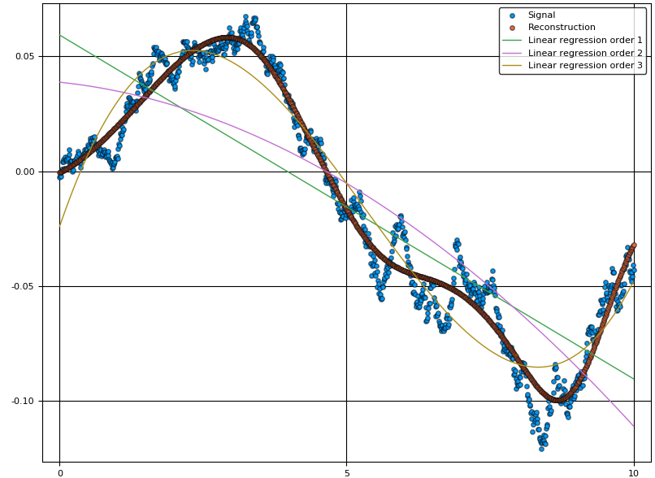
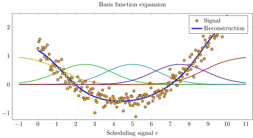
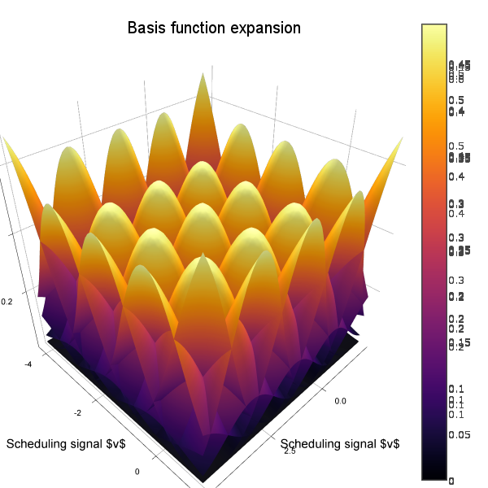
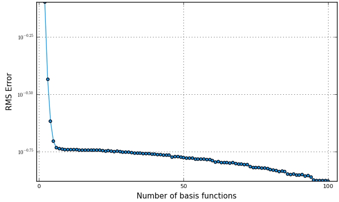
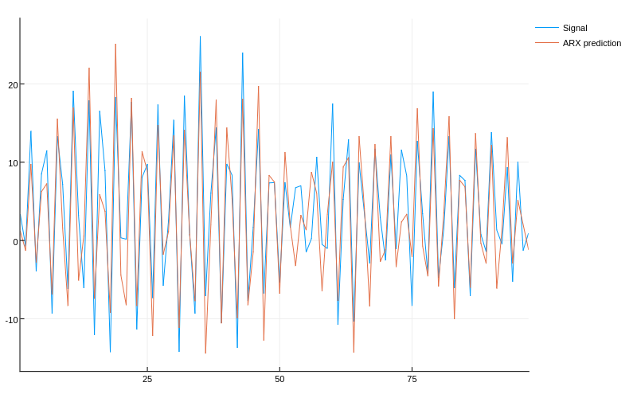
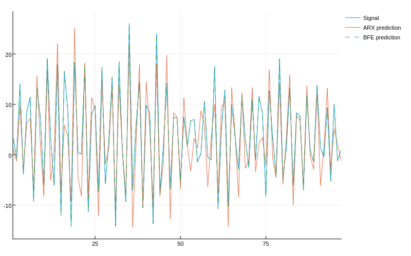
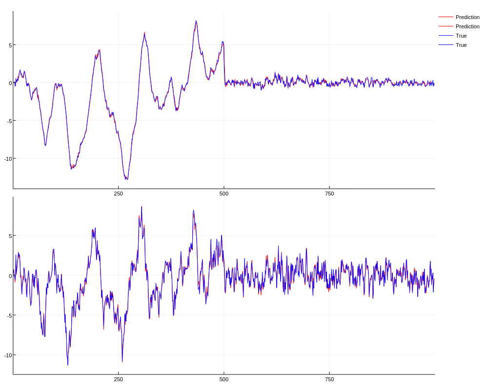

# BasisFunctionExpansions

[](http://pkg.julialang.org/?pkg=BasisFunctionExpansions)
[](https://travis-ci.org/baggepinnen/BasisFunctionExpansions.jl)
[](https://codecov.io/gh/baggepinnen/BasisFunctionExpansions.jl)

A Julia toolbox for approximation of functions using basis function expansions (BFEs).

BFEs are useful when one wants to estimate an arbitrary/unknown/complicated functional relationship between (in the simple case) two variables, ``y`` and ``v``. In simple linear regression, we might consider a functional relationship ``y = \phi(v) = \alpha v + \beta``, with parameters ``\alpha`` and ``\beta``. However, if the function ``\phi`` has an arbitrary nonlinar form, it might be hard to come up with suitable basis functions to use for linear regression. This package provides a set of convenient methods to estimate ``\phi(v)`` as a linear combination of basis functions, such as radial basis functions, for situations where ``v`` has a single or multiple dimensions.

```@contents
Depth = 3
```

# Exported functions and types
```@autodocs
Modules = [BasisFunctionExpansions]
Private = false
Pages   = ["BasisFunctionExpansions.jl"]
```


# Usage
We demonstrate typical usage with some examples.

The idea is to create an object representing an expansion. This object contains information regarding the domain of the expansion, which type of basis functions used and how many. These objects are, once created, callable with a scheduling vector/matrix. A call like this returns a vector/matrix of basis function activations.

To reconstruct a signal, a linear combination of basis functions must be estimated. To facilitate this, a second type of object is available: `BasisFunctionApproximation`. Once created, `BasisFunctionApproximation`s are callable with a scheduling signal and return an estimate of the output. The parameter estimation is performed behind the scenes using standard linear regression (least-squares). An optional regularization parameter can be supplied if needed, see `?BasisFunctionApproximation` for help.

Plotting functionality requires `Plots.jl`

## Single dimension
We start by simulating a signal ``y`` and a scheduling signal ``v``. The task is to estimate a function ``y = \phi(v)``, where ``\phi`` is a basis function expansion.
```julia
N = 1000
v = range(0, stop=10, length=N) # Scheduling signal
y = randn(N) # Signal to be approximated
y = filt(ones(500)/500,[1],y)
```

Next, we setup the basis function expansion object `rbf` and use it to create a reconstruction object `bfa`
```julia
Nv  = 10 # Number of basis functions
rbf = UniformRBFE(v,Nv, normalize=true) # Approximate using radial basis functions with constant width
bfa = BasisFunctionApproximation(y,v,rbf,1) # Create approximation object
ŷ   = bfa(v) # Reconstruct signal using approximation object
scatter(v,y, lab="Signal")
scatter!(v,ŷ, lab="Reconstruction")
```

For comparison, we can also plot the regular linear regression ``y = \alpha_0  + \alpha_1 x + \alpha_2 x^2... \alpha_n x^n`` for varying orders of ``n``.

```julia
A = v.^(0:3)'
ŷ_linreg = [A[:,1:i]*(A[:,1:i]\y) for i=2:4]
plot!(v,hcat(ŷ_linreg...), lab=["Linear regression order $i" for i=1:3]')
```


As we can see from the figure, the linear combination of basis functions forming the reconstruction has learnt the overall structure of the signal ``y``. To capture more detail, one can try to increase the number of basis functions. The final choice of this number is a tradeoff between reconstruction bias and variance, where a high number of basis functions can model the signal in great detail, but may increase the variance if data is sparse.

### Plotting
`BasisFunctionExpansion` objects can be plotted if `Plots.jl` is loaded. This works for 1 and 2 dimensional expansions only.
```julia
N   = 200
v   = range(0, stop=10, length=N)
y   = 0.1*(v-2).*(v-7) + 0.2randn(N)
rbf = UniformRBFE(v, 5, normalize = true)
bfa = BasisFunctionApproximation(y,v,rbf)

scatter(v,y,lab="Signal",c=:orange, subplot=1, xlabel="\$v\$", size=(600,300))
plot!(rbf)
plot!(v,bfa(v),lab="Reconstruction",c=:blue,linewidth=2)
```



## Multiple dimensions
We now demonstrate the same thing but with ``v \in \mathbf{R}^2``. To create a nice plot, we let ``v`` form a spiral with increasing radius.
```julia
using BasisFunctionExpansions
N = 1000
x = range(0, stop=4pi, length=N)
v = [cos(x) sin(x)].*x # Scheduling signal
y = randn(N) # Signal to be approximated
y = filt(ones(500)/500,[1],y)
```

Now we're creating a two-dimensional basis function expansion using ten functions in each dimension (for a total of 10*10=100 parameters).
```julia
Nv  = [10,10] # Number of basis functions along each dimension
rbf = MultiUniformRBFE(v,Nv, normalize=true) # Approximate using radial basis functions with constant width (Not isotropic, but all functions have the same diagonal covariance matrix)
bfa = BasisFunctionApproximation(y,v,rbf,0.0001) # Create approximation object
ŷ   = bfa(v) # Reconstruct signal using approximation object
scatter3d(v[:,1],v[:,2],y, lab="Signal")
scatter3d!(v[:,1],v[:,2],ŷ, lab="Reconstruction")
```


To visualize also the basis functions, we can simply call `plot!(rbf)` (the exclamation mark adds to the current plot instead of creating a new one).
Below is an example when a 5x5 BFE is visualized using `plotly` as backend.




### Nonuniform covariance
We can let all centers have different (diagonal) covariance matrices using the type `MultiDiagonalRBFE`. In this case, good center locations and covariances are estimated using K-means clustering. With this strategy, we can usually get away with much fewer basis functions compared to a uniform grid. A drawback is that we must know in advance which area of the scheduling signal space is of interest.
```julia
Nc   = 8
rbf  = MultiDiagonalRBFE(v,Nc, normalize=true)
bfa  = BasisFunctionApproximation(y,v,rbf,0.0001)
yhat = bfa(v)
scatter3d(v[:,1],v[:,2],y, lab="Signal")
scatter3d!(v[:,1],v[:,2],yhat, lab="Reconstruction")
```

### Full covariance
For the type `MultiRBFE` The covariance matrix and center locations are esimated using K-means.
```julia
Nc   = 8                            # Number of centers/BFs
rbf  = MultiRBFE(v,Nc, normalize=true)
bfa  = BasisFunctionApproximation(y,v,rbf,0.0001)
yhat = bfa(v)
scatter3d(v[:,1],v[:,2],y, lab="Signal")
scatter3d!(v[:,1],v[:,2],yhat, lab="Reconstruction")
```

# Selecting the number of basis functions
A simple way of choosing the number of basis functions is to plot an L-curve (parameter vs. error). A suitable number is where the kink in the curve occurs, for this example at around 6 basis functions.
```julia
N    = 200
v    = range(0, stop=10, length=N)
y    = 0.1*(v-2).*(v-7) + 0.2randn(N)
nvec = 2:100
lcurve = map(nvec) do n
  rbf = UniformRBFE(v, n, normalize = true)
  bfa = BasisFunctionApproximation(y,v,rbf)
  std(y-bfa(v))
end

plot(nvec, lcurve, yscale=:log10, ylabel="RMS Error", xlabel="Number of basis functions")
```



# Dynamics modeling
```@autodocs
Modules = [BasisFunctionExpansions]
Order   = [:type,:function]
Private = false
Pages   = ["dynamics.jl"]
```

## LPV ARX modeling
We can use basis function expansions for identification of elementary, non-linear dynamics models.
Consider the following dynamical system, with a non-linearity on the input
``A(z)y = B(z)\sqrt{|u|}``
We can simulate this system using the code
```julia
A = [1,2*0.7*1,1] # A(z) coeffs
B = [10,5]        # B(z) coeffs
u = randn(100)    # Simulate 100 time steps with Gaussian input
y = filt(B,A,sqrt.(abs.(u)))
```

We can now try to fit a regular ARX model to this input-output data
```julia
yr,A  = getARXregressor(y,u,3,2) # We assume that we know the system order 3,2
x     = A\yr                     # Fit using standard least-squares
e_arx = √(mean((yr - A*x).^2))   # Calculate RMS error (4.2553882233771025)
plot([yr A*x], lab=["Signal" "ARX prediction"])
```


Due to the non-linearity at the input of the system, the linear model fails to fit the data well. Our next attempt is a non-linear model based on BFEs. We select the simplest form of multi-dimensional BFE, `MultiUniformRBFE` and further select to cover the state-space with 2 basis functions along each dimension corresponding to ``y``, and 4 basis functions along each dimension corresponding to ``u`` for a total of 2^2*4^3=256 parameters (4 basis functions is the smallest number that can somewhat accurately fit ``\sqrt{|u|}``). The number of parameters in this case is large compared to the number of data points, we will need some regularization to fit this model properly. The regularization choice is made when forming the `BasisFunctionApproximation` and the strength is determined by the last argument `1e-3` in this case.
```julia
bfe   = MultiUniformRBFE(A,[2,2,4,4,4], normalize=true)
bfa   = BasisFunctionApproximation(yr,A,bfe, 1e-3)
e_bfe = √(mean((yr - bfa(A)).^2)) # (0.005174261451622258)
```


The non-linear model fits the data much better!

We also note that if we knew in advance that the system is linear with a non-linearity on the input, we could do this in a slightly more efficient way by incorporating lagged values of ``y`` directly in the regressor, instead of expanding the lagged values of ``y`` in a BFE. If we knew the exact non-linearity, we could simply transform our measured signal ``u`` and use it as input. With the LPV model, however, we can estimate the shape of the non-linearity.

## LPV State-space modeling
We can also estimate a state-space model with varying coefficient matrices, i.e. a model on the form
``x(t+1) = A(v)x(t) + B(v)u(t)``

This is accomplished using the built in convenience type `LPVSS`

Under the hood, the system ``x(t+1) = A(v)x(t) + B(v)u(t), \quad x(t) \in \mathbf{R}^n, u(t) \in \mathbf{R}^m``, which is linear in the parameters of ``A`` and ``B``, is written on the form ``x_i(t+1) = \Phi k_i(v) \quad \forall i \in [1,n]``, where ``\Phi`` is a regressor matrix consisting of ``x`` and ``u``, and ``k_i(v) \in \mathbf{R}^{n+m}`` are the coefficients to be estimated for each ``i``.

```@example
using Plots, BasisFunctionExpansions
T          = 1000
x,xm,u,n,m = BasisFunctionExpansions.testdata(T)
nc         = 4
v          = 1:T
model      = LPVSS(x, u, v, nc; normalize=true, λ = 1e-3)
xh         = model(x,u,v)

eRMS       = √(mean((xh[1:end-1,:]-x[2:end,:]).^2))

plot(xh[1:end-1,:], lab="Prediction", c=:red, layout=(2,1))
plot!(x[2:end,:], lab="True", c=:blue); gui()
#savefig("src/figs/lpvss.svg"); # hide
nothing # hide
```



# Gradients
BasisFunctionExpansions plays nice with [ReverseDiff.jl](https://github.com/JuliaDiff/ReverseDiff.jl) and [ForwardDiff.jl](https://github.com/JuliaDiff/ForwardDiff.jl)

```jldoctest
julia> using ReverseDiff
julia> a = randn(1,2)
julia> ReverseDiff.gradient(bfa,a) # bfa here comes from the Multi-dim example
1×2 Array{Float64,2}:
 1.29364  -0.536586

julia> h = 0.0001 # Finite difference for validation
0.0001

julia> [(bfa(a+[h 0]) - bfa(a))/h (bfa(a+[0 h]) - bfa(a))/h]
1×2 Array{Float64,2}:
 1.29363  -0.536488
```

Note: for `ForwardDiff.jl` to work, you have to use `ForwardDiff.jacobian` instead of  `ForwardDiff.gradient`.

See `?ReverseDiff.gradient` for tips regarding high performance gradient calculation through preallocation of GradientConfig and prerecording of `bfa`.

# Learn more
Functionality in this package is used in the packages
* [Robotlib.jl](https://github.com/baggepinnen/Robotlib.jl)
* [LPVSpectral.jl](https://github.com/baggepinnen/LPVSpectral.jl)
* [DynamicMovementPrimitives.jl](https://github.com/baggepinnen/DynamicMovementPrimitives.jl)

And in the papers
* ["Linear Parameter-Varying Spectral Decomposition" Bagge Carlson, Fredrik; Robertsson, Anders and Johansson, Rolf (2017) American Control Conference Conference](http://lup.lub.lu.se/record/ac32368e-e199-44ff-b76a-36668ac7d595)
* ["Modeling and Identification of Position and Temperature Dependent Friction Phenomena without Temperature Sensing" Bagge Carlson, Fredrik; Robertsson, Anders and Johansson, Rolf (2015) IEEE/RSJ International Conference on Intelligent Robots and Systems](http://lup.lub.lu.se/record/7613758)


# Index

```@index
```
